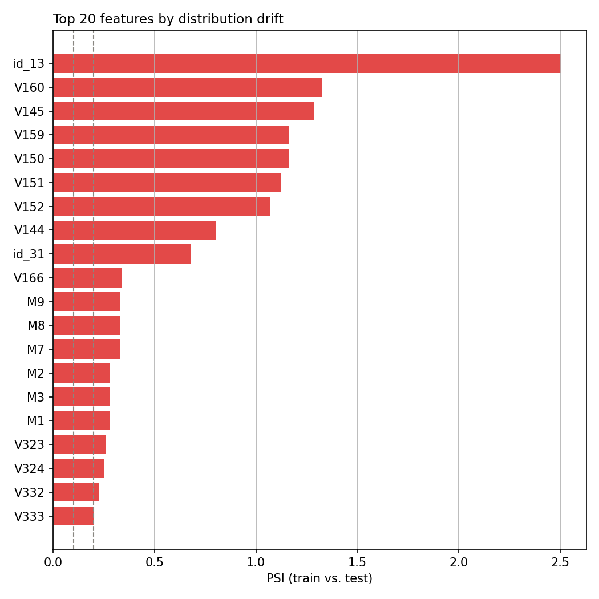
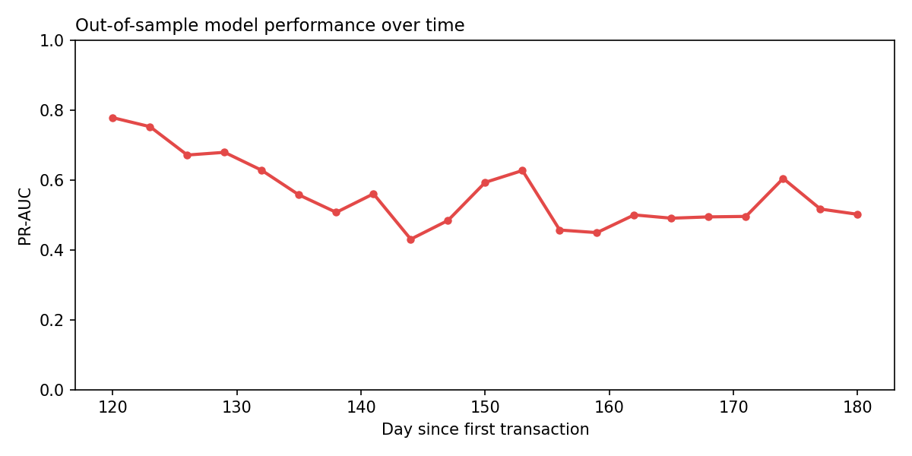
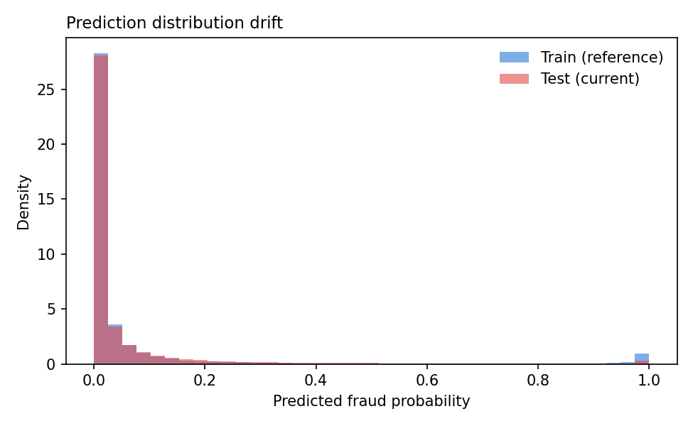

# Drift Monitoring Report

Compares the training window (reference) against the held-out test window (current, most recent ~15% of transactions) using PSI (Population Stability Index) and KS (Kolmogorov-Smirnov) for feature distributions, plus out-of-sample model performance across time windows. This is what a scheduled monitoring job would run against fresh production data to decide whether the model needs retraining.

## Retraining recommendation

**RETRAIN RECOMMENDED**

- out-of-sample PR-AUC dropped 35.5% relative to the first post-training window, above the 25% threshold

## Feature distribution drift

20 of 431 features (4.6%) show significant drift (PSI > 0.2) between train and test.

Top 10 most drifted features:

| Feature | Type | PSI | KS stat | KS p-value | Severity |
|---|---|---|---|---|---|
| `id_13` | numeric | 2.503 | 0.274 | 0.0000 | significant |
| `V160` | numeric | 1.329 | 0.136 | 0.0000 | significant |
| `V145` | numeric | 1.286 | 0.129 | 0.0000 | significant |
| `V159` | numeric | 1.162 | 0.124 | 0.0000 | significant |
| `V150` | numeric | 1.160 | 0.133 | 0.0000 | significant |
| `V151` | numeric | 1.125 | 0.129 | 0.0000 | significant |
| `V152` | numeric | 1.071 | 0.137 | 0.0000 | significant |
| `V144` | numeric | 0.804 | 0.112 | 0.0000 | significant |
| `id_31` | categorical | 0.678 | — | — | significant |
| `V166` | numeric | 0.338 | 0.096 | 0.0000 | significant |

## Model performance over time (out-of-sample)

PR-AUC in 3-day windows across the validation+test period (never seen during training):

PR-AUC moved from 0.778 in the first post-training window to 0.502 in the last (35.5% relative change). This directly reflects the fraud-rate drift observed in the EDA report — fraud patterns are non-stationary, so performance monitoring (not just a one-time validation score) is necessary in production.

## Prediction distribution drift

PSI on the predicted fraud probability distribution (train vs. test): **0.005** (none). This is a label-free proxy — useful in production where ground-truth fraud labels arrive with a delay (chargebacks take time to materialize), so this signal is available well before performance-over-time can be computed.

**This is the report's most important finding.** The prediction-distribution PSI (0.005) shows essentially no drift, while the out-of-sample PR-AUC dropped 35.5%. A monitoring setup that only watched prediction distributions (the label-free signal, available immediately) would have completely missed this degradation — because what changed is the *relationship* between features and the fraud label (concept drift), not the input distribution the model scores. That's consistent with only 4.6% of raw features showing significant PSI drift too. The practical implication: for this problem, label-free monitoring alone is not sufficient, and a production system needs a fast-as-possible feedback loop on delayed ground truth (chargebacks) rather than relying on distribution-drift proxies alone.
