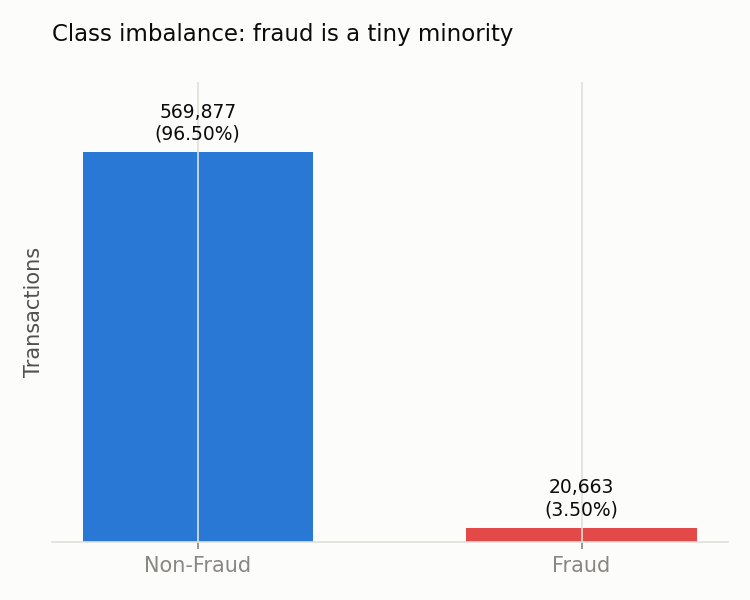
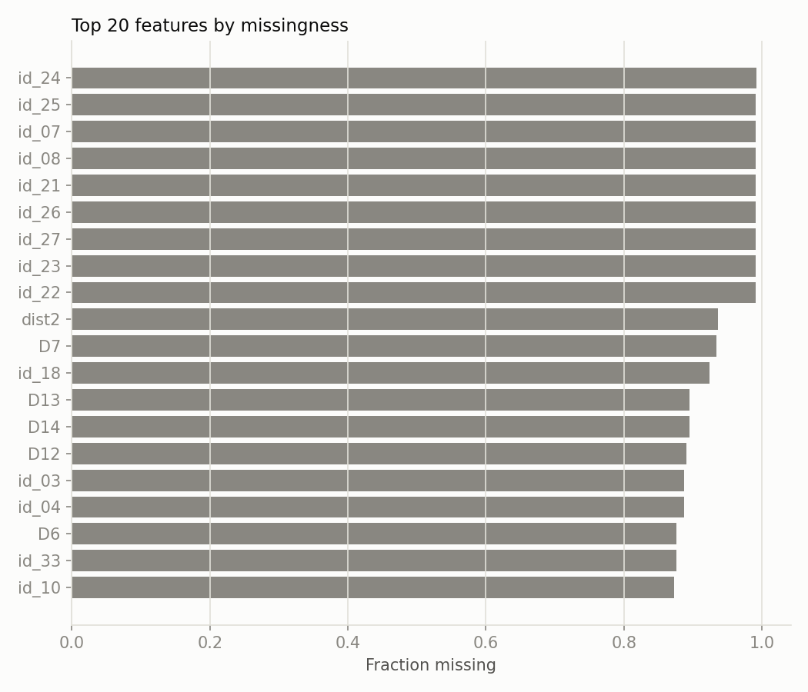
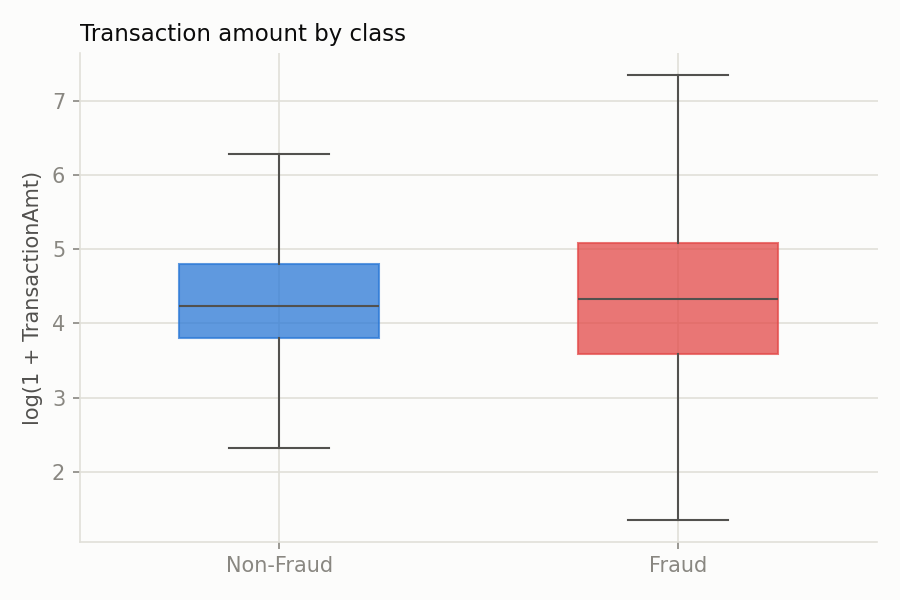
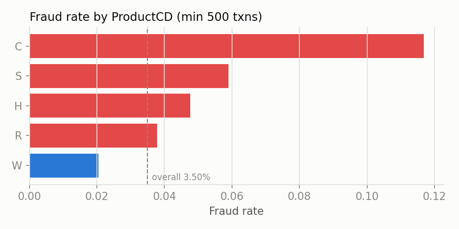
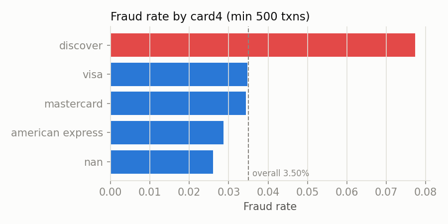
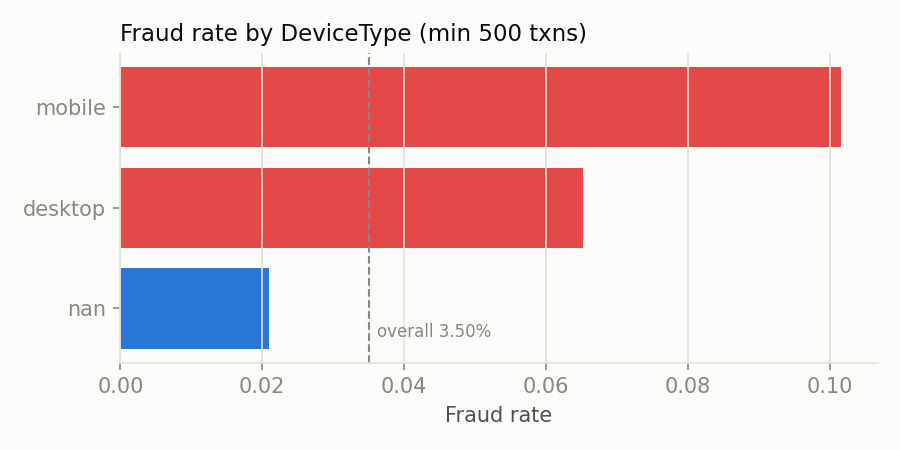
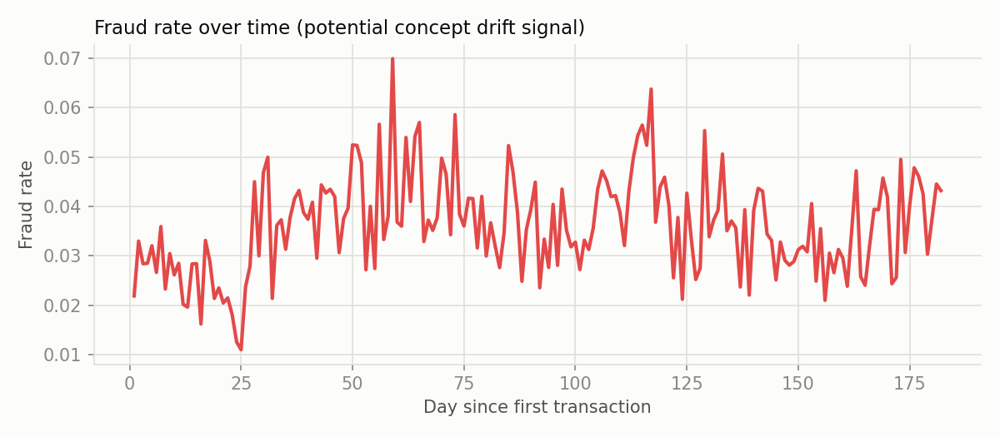
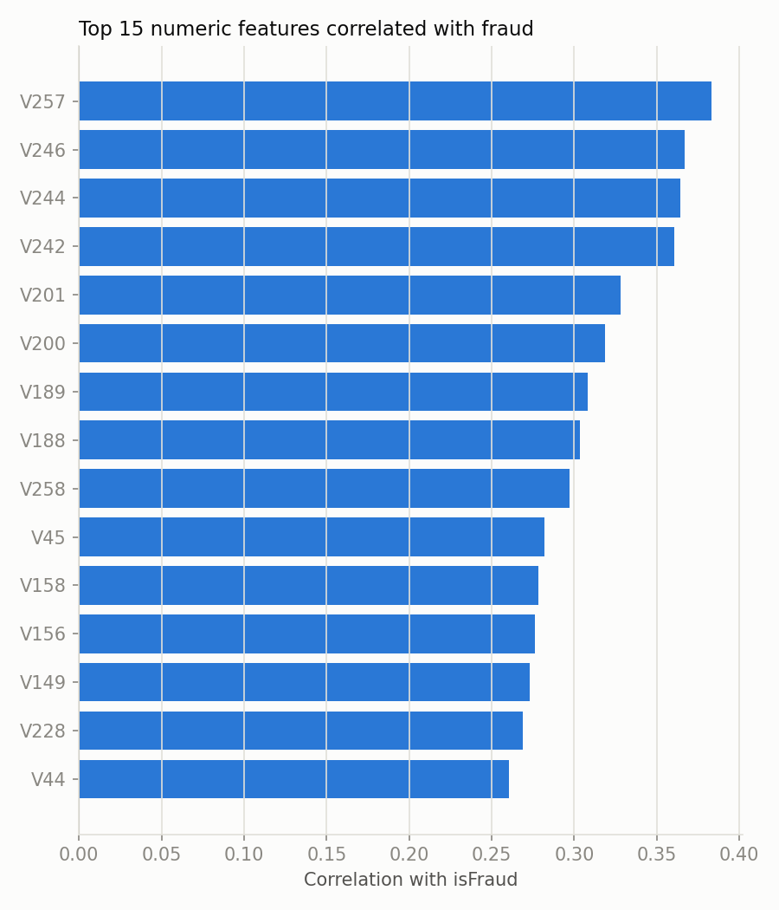

# EDA Report — IEEE-CIS Fraud Detection

## Class imbalance

- Total transactions: 590,540
- Non-fraud: 569,877 (96.50%)
- Fraud: 20,663 (3.50%)

Fraud is under 4% of all transactions — a naive model predicting "not fraud" for everything would score >96% accuracy while catching zero fraud. This is why the project optimizes for PR-AUC / precision-recall tradeoffs instead of accuracy.

## Missingness

- 12 features are >90% missing.
- 214 features are >50% missing.
- Most missingness comes from the `id_*`/`D*`/`V*` feature blocks and identity fields that are only populated for a subset of transactions — this is informative (missingness itself can correlate with fraud) rather than pure noise, so it's preserved as a signal (e.g. via LightGBM's native NaN handling) rather than aggressively imputed.

## Transaction amount

## Fraud rate by category

## Fraud rate over time

Fraud rate is not stationary across the observed window, which motivates the drift monitoring module later in the project — a model trained on early data may not reflect the fraud patterns in later data.

## Top correlated numeric features

Correlation is a coarse signal (fraud is driven by nonlinear feature interactions that LightGBM/XGBoost captures far better than linear correlation), but it's a useful first pass for sanity-checking which engineered `C*`/`V*`/`D*` features carry signal.

