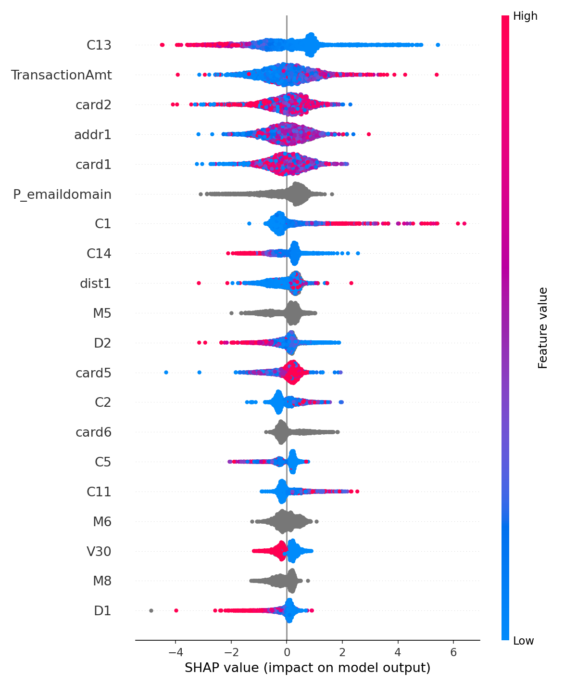
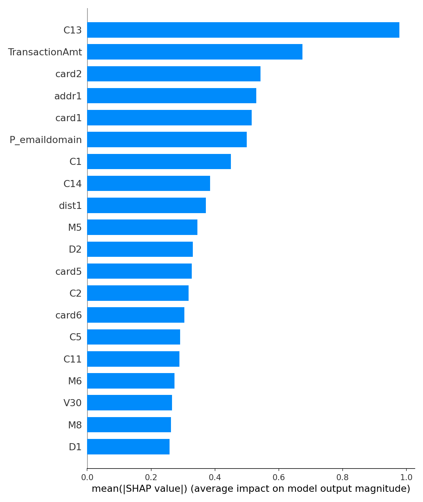

# Explainability Report — SHAP

SHAP (TreeExplainer) values for the main LightGBM model, computed on the held-out test split. Values are in log-odds space (the model's raw output before the sigmoid) — positive SHAP values push a prediction toward fraud, negative values push away from it.

## Global feature importance

Computed on a random sample of 3,000 test transactions.

The dominant drivers are the anonymized `V*`/`C*`/`D*` engineered features (consistent with the correlation analysis in the EDA report), plus `TransactionAmt`, `card1`/`card2` (card identifiers), and `addr1`. Kaggle doesn't disclose what the `V*` columns represent, which is a real limitation for regulatory explanations in production — see Limitations in the main README.

## Local explanations

The full pipeline (`src/explainability/generate_shap_report.py`) also generates waterfall explanations for three representative real transactions — a confidently caught fraud, a missed fraud, and a false alarm — showing the top SHAP-contributing features with their real values, exactly like the JSON response `POST /predict` returns for a live transaction.

**Those per-transaction examples are intentionally excluded from this repo.** They contain real per-transaction feature values from the IEEE-CIS Kaggle competition dataset, which restricts redistributing competition data outside the competition. This report's charts above are safe to share because they're aggregate statistics over a sample, not individual records — a waterfall plot for one specific transaction is not. Regenerate them locally (with your own Kaggle access, see the main README's Setup section) via the command above; the local-only output goes to `reports/explainability/shap_local_examples_LOCAL_ONLY.md` and `reports/figures/shap_local_*.png`, both gitignored.
