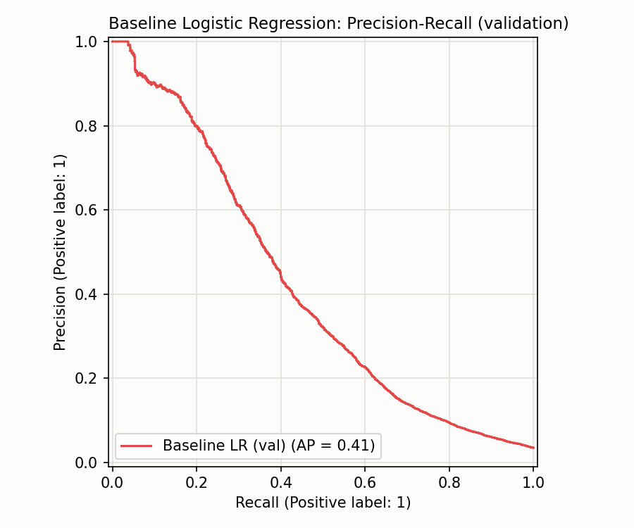

# Baseline Model — Logistic Regression

Time-based split (train on earliest 70%, validate on next 15%, test on most recent 15%). `class_weight="balanced"` used since fraud is 3.50% of transactions.

## Metrics

| Split | PR-AUC | ROC-AUC |
|---|---|---|
| Validation | 0.4123 | 0.8500 |
| Test | 0.1891 | 0.8299 |

## Validation classification report (threshold = 0.5)

```
              precision    recall  f1-score   support

   Non-Fraud       0.99      0.84      0.91     85539
       Fraud       0.14      0.70      0.23      3042

    accuracy                           0.84     88581
   macro avg       0.56      0.77      0.57     88581
weighted avg       0.96      0.84      0.89     88581

```



PR-AUC (not accuracy) is the headline metric: at 3.5% fraud prevalence, a model that never flags fraud still scores ~96.5% accuracy. This baseline establishes the floor that the main LightGBM/XGBoost model (with a proper imbalance-handling comparison) needs to beat.
