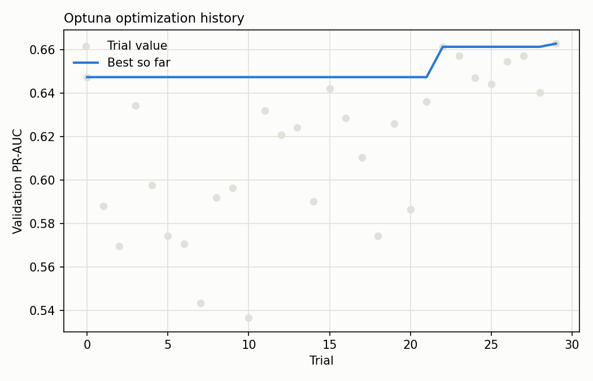

# Hyperparameter Tuning — Optuna

Searched 30 trials over learning rate, tree complexity (`num_leaves`, `min_child_samples`), row/column sampling fractions, and L1/L2 regularization, optimizing validation PR-AUC with the same time-based split and class-weighting approach as [main_model_comparison.md](main_model_comparison.md). TPE sampler (Optuna's default), seeded for reproducibility.

## Best trial

Validation PR-AUC: **0.6628**

| Hyperparameter | Value |
|---|---|
| `learning_rate` | 0.1571 |
| `num_leaves` | 160 |
| `feature_fraction` | 0.5805 |
| `bagging_fraction` | 0.9323 |
| `bagging_freq` | 3 |
| `min_child_samples` | 9 |
| `lambda_l1` | 1.951e-05 |
| `lambda_l2` | 0.0001493 |

## Test set result

| Model | Test PR-AUC | Test ROC-AUC |
|---|---|---|
| Hand-picked defaults (current) | 0.5174 | 0.8929 |
| Optuna-tuned | 0.5619 | 0.9008 |

**Adopted.** The tuned model improved test PR-AUC from 0.5174 to 0.5619 (+8.6% relative) and now backs the API/dashboard (`models/main_model.txt`).
