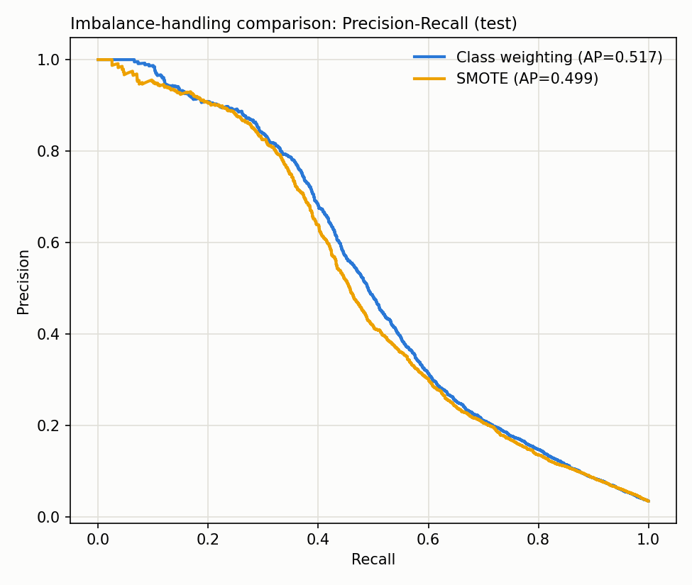

# Main Model — LightGBM Imbalance-Handling Comparison

**Note:** the numbers below use fixed, hand-picked hyperparameters, deliberately kept
identical across all three techniques so this comparison isolates the imbalance-handling
technique's effect in isolation. The model actually deployed (`models/main_model.txt`)
has since been hyperparameter-tuned on top of the winning technique (class weighting) —
see [hyperparameter_tuning.md](hyperparameter_tuning.md) for the current numbers. This
report remains accurate as a comparison of *techniques*, just not of the final deployed
model's absolute performance.

Same LightGBM hyperparameters and time-based split across all three techniques (see [baseline_metrics.md](baseline_metrics.md) for the split methodology) — only the imbalance-handling technique differs, isolating its effect.

## Results (test set)

| Technique | PR-AUC | ROC-AUC | Precision | Recall | F1 | F2 | Threshold |
|---|---|---|---|---|---|---|---|
| Class weighting (scale_pos_weight) | 0.5174 | 0.8929 | 0.559 | 0.458 | 0.503 | 0.475 | 0.500 |
| SMOTE (SMOTENC, 30% minority ratio) | 0.4989 | 0.8905 | 0.865 | 0.271 | 0.413 | 0.314 | 0.500 |
| Class weighting + tuned threshold | 0.5174 | 0.8929 | 0.372 | 0.561 | 0.447 | 0.509 | 0.283 |

## Choice: class weighting + tuned threshold

`scale_pos_weight` is used during training (not SMOTE) because PR-AUC — the ranking-quality metric that doesn't depend on threshold — is 0.5174 for class weighting vs. 0.4989 for SMOTE. SMOTENC's synthetic interpolation in a ~430-dimensional mixed numeric/categorical space tends to blur the true decision boundary for gradient-boosted trees, which already handle imbalance well through the loss reweighting `scale_pos_weight` provides — the literature on SMOTE with tree ensembles on high-dimensional tabular data generally finds the same pattern. SMOTE also requires imputing away LightGBM's native missing-value handling to make interpolation possible, discarding the "missingness is signal" property noted in the EDA.

The default 0.5 threshold is not calibrated for a 3.5%-prevalence problem, so the final operating point tunes the decision threshold on the validation set to maximize F2 (recall weighted over precision, since missing fraud is costlier than a false alarm) — moving from precision 0.559/recall 0.458 at threshold 0.5 to precision 0.372/recall 0.561 at threshold 0.283.

ADASYN was not run as a separate experiment: it targets the same failure mode as SMOTE (synthetic minority generation, adaptively focused on harder-to-classify minority samples) and the SMOTE result already demonstrates that oversampling underperforms class weighting here — a second oversampling variant was judged unlikely to change the conclusion enough to justify the added runtime.
